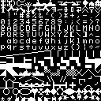

# up5k_basic
A small 6502 system with MS BASIC in ROM. This system
includes the following features:

* 32kB SRAM (using one of the four available SPRAM cores)
* 8 bits input, 8 bits output
* 115200bps serial I/O port
* NTSC composite video with text/glyph and graphic modes, 32kB video RAM and
  original OSI 2kB character ROM
* 2kB ROM for startup and I/O support
* 8kB ROM for Ohio Scientific C1P Microsoft BASIC
* 2kB ROM for the video character generator
* SPI port
* LED PWM driver

## prerequisites
To build this you will need the following FPGA tools

* Icestorm - ice40 FPGA tools
* Yosys - Synthesis
* Nextpnr - Place and Route (newer than Mar 23 2019)

Info on these can be found at http://www.clifford.at/icestorm/

You will also need the following 6502 tools to build the startup ROM:

* cc65 6502 C compiler (for default option) https://github.com/cc65/cc65

## Building

	git clone https://github.com/emeb/up5k_basic.git
	cd up5k_basic
	git submodule update --init
	cd icestorm
	make

## Loading

I built this system on a custom up5k board and programmed it with a custom
USB->SPI board that I built so you will definitely need to tweak the programming
target of the Makefile in the icestorm directory to match your own hardware.

## Running BASIC

You will need to connect a 115200bps serial terminal port to the TX/RX pins of
the FPGA (depends on your .pcf definitions - pins 3/4 in my build for the
upduino). Load the bitstream an you'll see the boot prompt:

    C/W/M?

This is asking if you're doing a cold or warm start. Hit "C" (must be
uppercase) and then BASIC will start running. It will prompt you:

    MEMORY SIZE?

to which you answer with 'enter' to let it use all memory. It then prompts
with:

    TERMINAL WIDTH?

Again, hit 'enter' to use the default. It then prints a welcome message and
is ready to accept BASIC commands and code. You can find out more about
how to use this version of BASIC here: https://www.pcjs.org/docs/c1pjs/

## Boot ROM

The 2kB ROM located at $f800 - $ffff contains the various reset/interrupt
vectors, initialization code and serial I/O routines needed to support
BASIC. It's extremely stripped-down and just handles character input, output
and Control-C checking - the load and save vectors are currently stubbed out.

You can revise this ROM with your own additional support code, or to reduce the
size of the ROM to free up resources for more RAM - you'll need to edit the
linker script to change the memory sizes, as well as modify the rom_monitor.s
file with code changes. The cc65 assembler and linker are required to put it
all together into the final .hex file needed by the FPGA build.

## Video

This is a simple NTSC composite video generator which
is based on the original Ohio Scientific C1P system. The luma and sync output
bits should be combined by running sync thru a 560 ohm resistor and luma thru a
330 ohm resistor to a common node driving a 75 ohm baseband composite video
load. This will generate a 262-line 60fps progressive-scanned NTSC-compatible
signal which should work with most modern NTSC-capable video displays.

The video generation has been upgraded from the OSI 24x24 display

* Memory arbitration to prevent glitching when the 6502 accesses video RAM
* 256 x 224 B/W pixel graphics mode
* 4 pages text or graphics
* 32 characters wide by 27 lines high plus overscan using the original OSI
character generator, complete with all the unique gaming glyphs like tanks,
cars and spaceships as shown in this rendering:

## SPI

The iCE40 Ultra Plus features two SPI and two I2C ports as hard IP cores that
are accessible through a "system bus" that's similar to the popular Wishbone
standard. I've added a 6502 to Wishbone bridge mapped to addresses $F100-$F1FF
which provides access to all four cores. Currently only the SPI core at
addresses $F106-$F10F is connected but I've tested it and added some bare-bones
access routines in the support ROM. This requires features that were added
to nextpnr on March 23, 2019 so make sure you've got the latest from git.

## LED PWM

Many FPGAs in the iCE40 family provide hard IP cores for driving RGB LEDs. A
simple interface to this is provided so the 6502 may control the LED driver.

## Simulating

Simulation is supported and requires the following prerequisites:

* Icarus Verilog simulator http://iverilog.icarus.com/
* GTKWave waveform viewer http://gtkwave.sourceforge.net/

To simulate, use the following commands

	cd icarus
	make
	make wave

This will build the simulation executable, run it and then view the output.

## Copyright

There have been questions raised about the copyright status of the MS BASIC
provided in this project. To the best of my knowledge, the contents of the file
src/basic_8k.hex is still property of Microsoft and is used here for educational
purposes only. The full source code for this can be found at:

https://github.com/brajeshwar/Microsoft-BASIC-for-6502-Original-Source-Code-1978

The ROM files from which I created the .hex file are also available in many
places - I used this archive: http://www.osiweb.org/misc/OSI600_RAM_ROM.zip

## Thanks

Thanks to the developers of all the tools used for this, as well as the authors
of the IP cores I snagged for the 6502 and UART. I've added those as submodules
so you'll know where to get them and who to give credit to.
